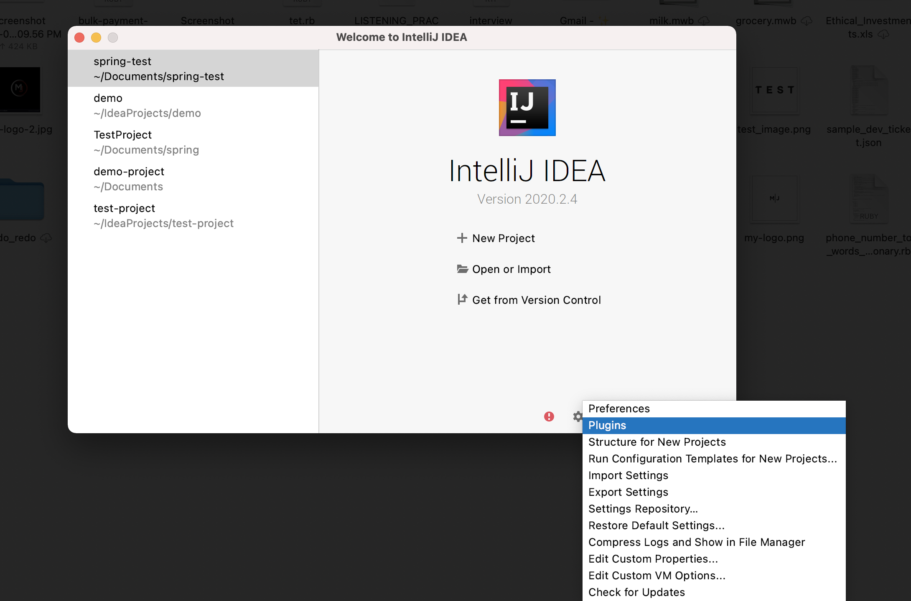
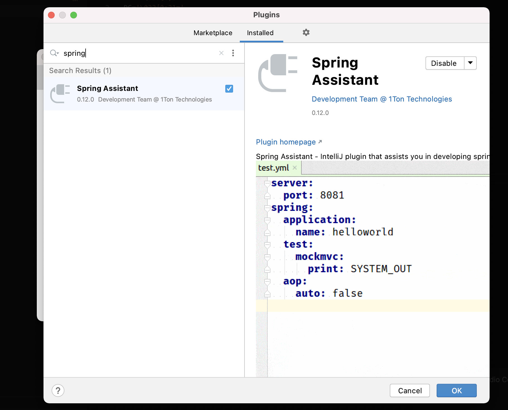
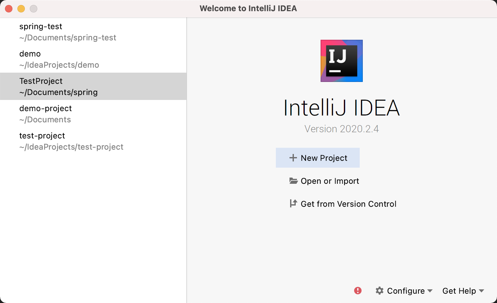
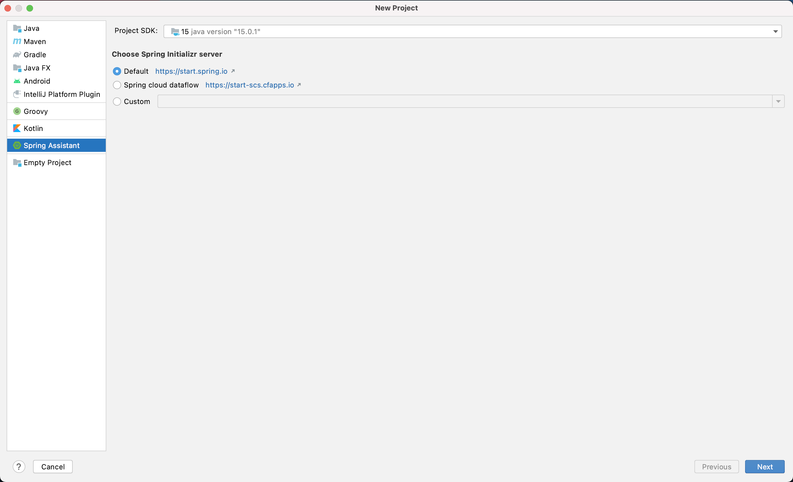
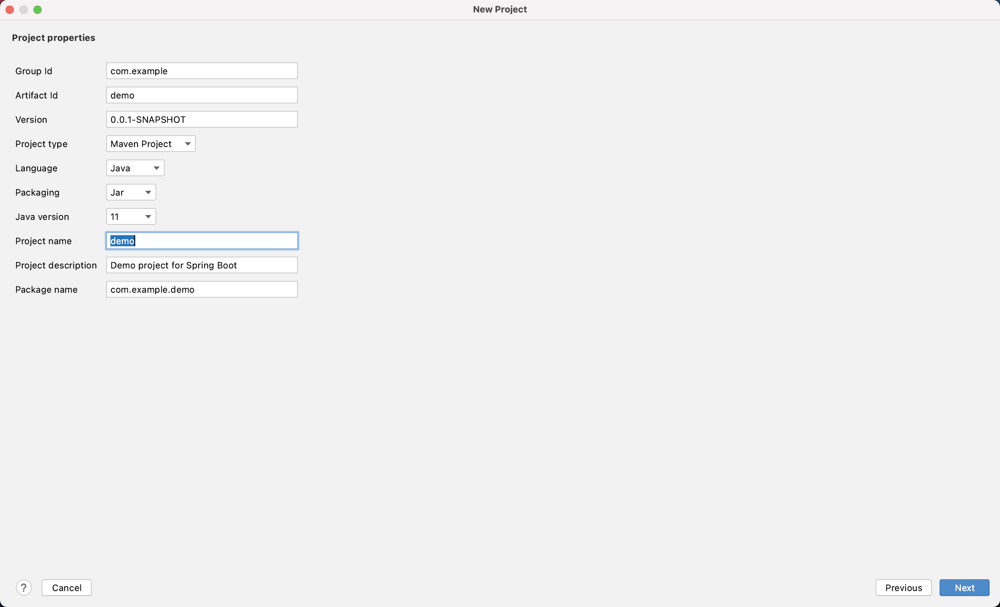
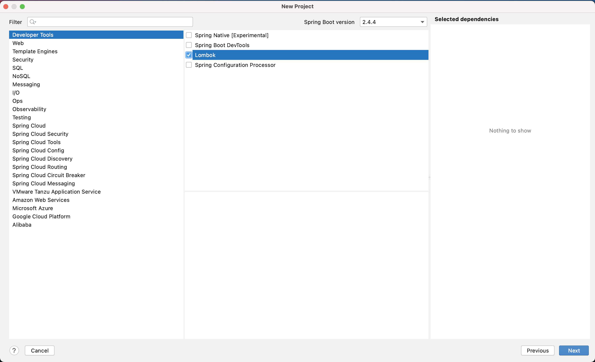

### Spring Boot Setup

#### 1 Install JetBrains using CMD

##### IntelliJ Community Edition

```
brew cask install intellij-idea-ce
```

##### IntelliJ Ultimate Edition

```
brew cask install intellij-idea
```

#### 2. Install Spring Boot

```
brew tap spring-io/tap
```

```
brew install spring-boot
```

#### 3. Install OpenJdk

```
asdf plugin-add java
asdf install java adoptopenjdk$OPEN_JDK_VERSION
asdf global java adoptopenjdk$OPEN_JDK_VERSION
. ~/.asdf/plugins/java/set-java-home.zsh
```

#### 4.Install Maven

```
brew install maven 
```

Note: if you got error like,

Error: Permission denied @ apply2files - /usr/local/share/...

```
brew cleanup

sudo brew cleanup

sudo chown -R $(whoami) /usr/loca

sudo chown -R $(whoami) /usr/local/share
```

THEN Configure plugins




THEN Search plugins and install, Enable

Ex, Spring Assistant




##### Create a new Spring App

CLICK New Project




THEN Select `Spring Assistant`



THEN Configure project type and Project name




THEN Select `Lambok`



THEN Confirm Project and Finish


